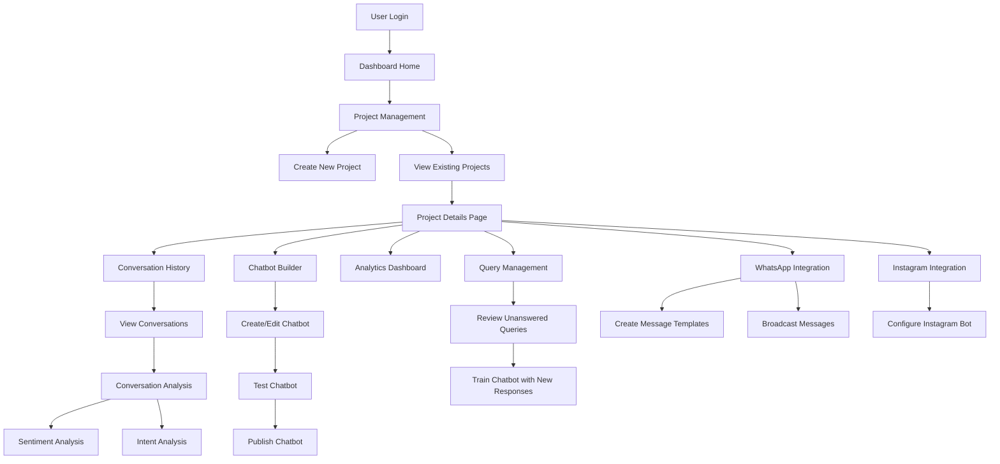

# AI Chatbot Dashboard User Flow

## Overview
This document outlines the user flow for the AI-powered chatbot dashboard that integrates with WhatsApp and Instagram. The system allows users to create, manage, and analyze chatbot interactions across multiple platforms.

## Main User Flow

## Detailed Flow Description

1. **User Authentication**
   - User login to dashboard
   - Access to project management

2. **Project Management**
   - Create new chatbot projects
   - View and manage existing projects
   - Project settings and configuration

3. **Project Details Page**
   - Overview of project metrics
   - Quick access to all project features
   - Project settings and configuration

4. **Conversation History**
   - View all bot-customer interactions
   - Filter conversations by date, platform, or status
   - Access detailed conversation logs

5. **Analytics Dashboard**
   - Sentiment analysis of customer interactions
   - Intent analysis of conversations
   - Performance metrics and insights
   - Usage statistics

6. **Chatbot Builder**
   - Create new chatbot flows
   - Edit existing chatbot configurations
   - Test chatbot responses
   - Publish chatbot to platforms

7. **Query Management**
   - Review unanswered queries
   - Train chatbot with new responses
   - Improve bot understanding

8. **Platform Integration**
   - WhatsApp Integration
     - Create message templates
     - Configure broadcast messages
     - Manage WhatsApp business settings
   - Instagram Integration
     - Configure Instagram bot settings
     - Manage Instagram interactions

## Key Features

- **Project Management**: Create and manage multiple chatbot projects
- **Conversation Analysis**: Track and analyze all bot-customer interactions
- **Sentiment Analysis**: Monitor customer sentiment (for analysis only)
- **Intent Analysis**: Track customer intents and bot responses
- **Chatbot Builder**: Create, edit, and test chatbots
- **Query Management**: Handle unanswered queries and train the bot
- **Platform Integration**: Manage WhatsApp and Instagram integrations
- **Broadcast Messaging**: Send messages to multiple users

## Notes

- Sentiment analysis is for monitoring purposes only and doesn't affect the chatbot's behavior
- The system focuses on user intent and response accuracy
- All platform integrations (WhatsApp, Instagram) are managed through their respective sections
- Analytics are available at both project and conversation levels 